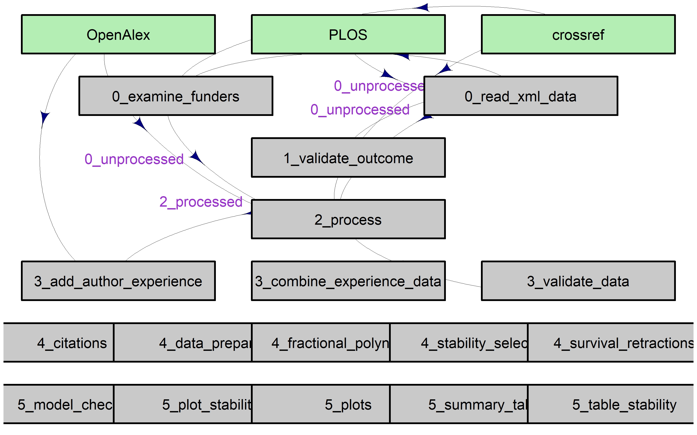

# Who chooses open peer review?

Research Questions: 

1. What are the characteristics of articles at _PLOS ONE_ where the authors chose open peer review?

2. Does choosing open peer review predict research quality via citations and retractions?

XML data downloaded from [PLOS](https://plos.org/resource/open-peer-review/). Before publication, authors can choose to have the peer review published alongside their paper, providing the binary outcome of opting in to open peer review (yes/no).

The _R_ files are in order of execution with a prefix of:

* 0_ read in the XML files and exclude papers that were not peer reviewed
* 1_ get the funders' data
* 2_ process the authors' countries and papers' topics
* 3_ add the authors number of papers
* 4_ run the statistical models for the quality outcomes (citations and retractions); add author paper counts; random sample of reviews
* 4_ prepare data and run stability selection
* 5_ report main model and run model checks
* 99_ other files, including some functions

## How the key files and data are inter-linked



The subfolders are:

* `R` for R functions.
* `checks` for random checks of the data.
* `data` data in _R_ format.
* `figures` for figures.
* `results` for results in RData format, latex-ready tables, rmarkdown reports.
* `reviews` a random selection of the open peer reviews

<details><summary>R version and packages</summary>
<p>

```
R version 4.5.2 (2025-10-31 ucrt)
Platform: x86_64-w64-mingw32/x64
Running under: Windows 11 x64 (build 26100)

Matrix products: default
  LAPACK version 3.12.1

locale:
[1] LC_COLLATE=English_Australia.utf8  LC_CTYPE=English_Australia.utf8   
[3] LC_MONETARY=English_Australia.utf8 LC_NUMERIC=C                      
[5] LC_TIME=English_Australia.utf8    

time zone: Australia/Brisbane
tzcode source: internal

attached base packages:
[1] stats     graphics  grDevices utils     datasets  methods   base     

other attached packages:
[1] broom_1.0.11    survminer_0.5.1 ggpubr_0.6.2    survival_3.8-6 
[5] gridExtra_2.3   ggplot2_4.0.2   stringr_1.6.0   dplyr_1.1.4    

loaded via a namespace (and not attached):
 [1] utf8_1.2.6         generics_0.1.4     tidyr_1.3.1       
 [4] rstatix_0.7.3      stringi_1.8.7      lattice_0.22-7    
 [7] digest_0.6.39      magrittr_2.0.4     evaluate_1.0.5    
[10] grid_4.5.2         RColorBrewer_1.1-3 fastmap_1.2.0     
[13] Matrix_1.7-4       backports_1.5.0    Formula_1.2-5     
[16] purrr_1.2.0        scales_1.4.0       textshaping_1.0.4 
[19] abind_1.4-8        cli_3.6.5          KMsurv_0.1-6      
[22] rlang_1.1.6        splines_4.5.2      withr_3.0.2       
[25] yaml_2.3.11        tools_4.5.2        ggsignif_0.6.4    
[28] km.ci_0.5-6        vctrs_0.6.5        R6_2.6.1          
[31] zoo_1.8-14         lifecycle_1.0.5    car_3.1-3         
[34] ragg_1.5.0         pkgconfig_2.0.3    pillar_1.11.1     
[37] gtable_0.3.6       data.table_1.17.8  glue_1.8.0        
[40] systemfonts_1.3.1  xfun_0.54          tibble_3.3.0      
[43] tidyselect_1.2.1   rstudioapi_0.17.1  knitr_1.50        
[46] xtable_1.8-4       survMisc_0.5.6     farver_2.1.2      
[49] htmltools_0.5.9    rmarkdown_2.30     carData_3.0-5     
[52] labeling_0.4.3     compiler_4.5.2     S7_0.2.1     
```

</p>
</details>